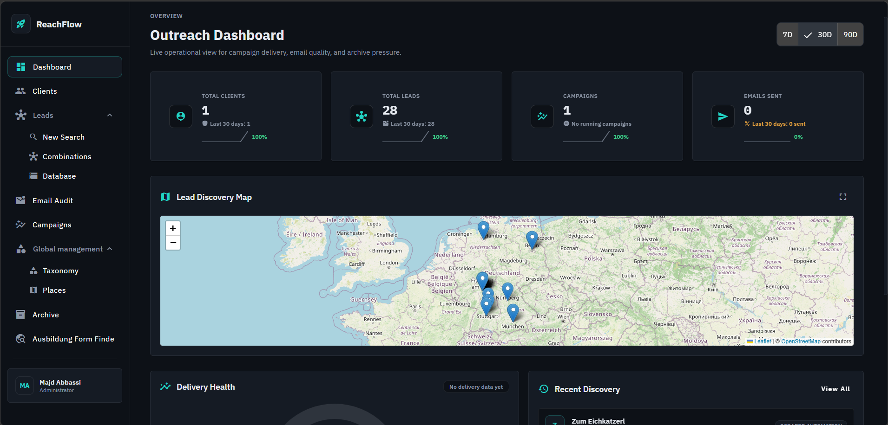
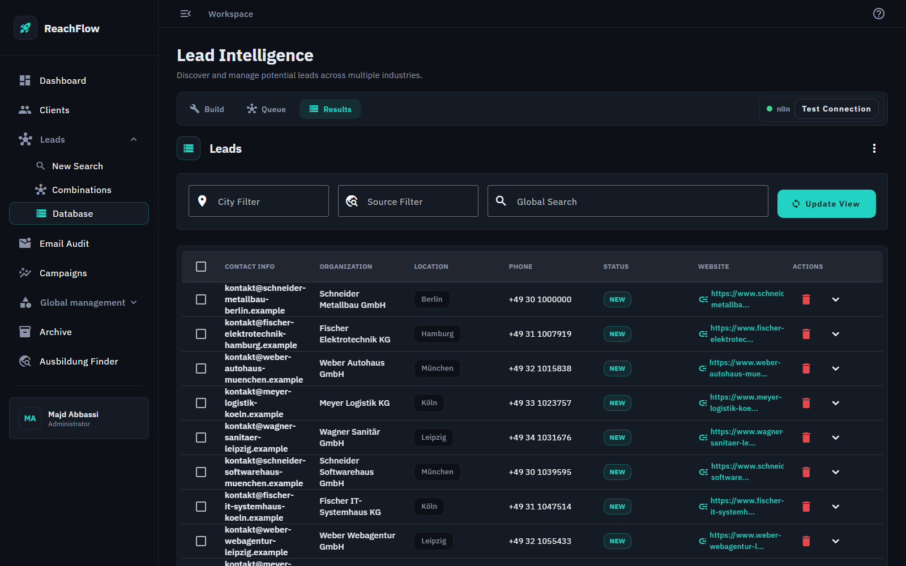
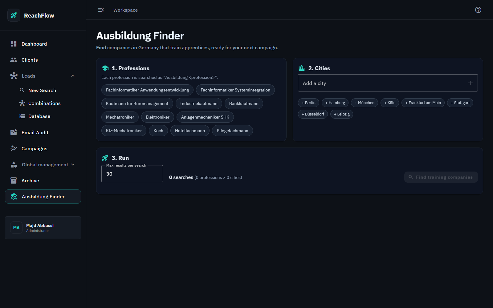
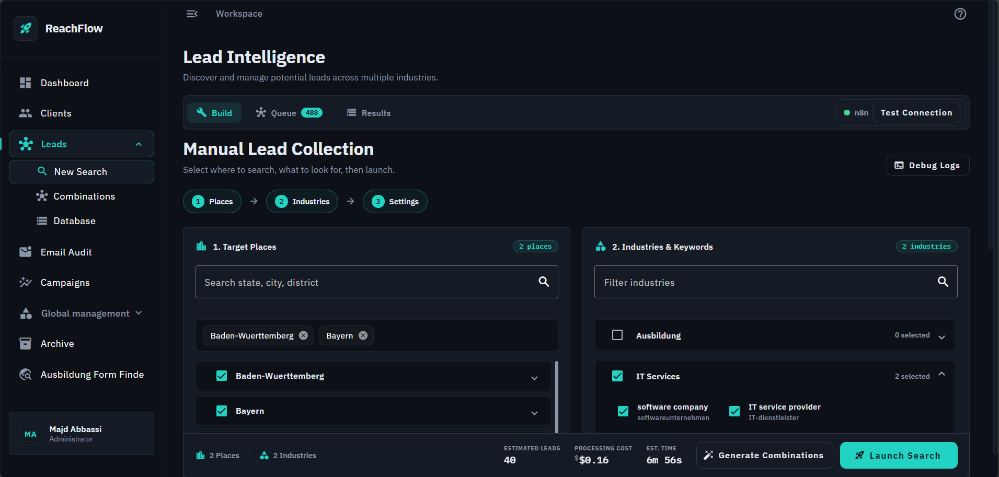
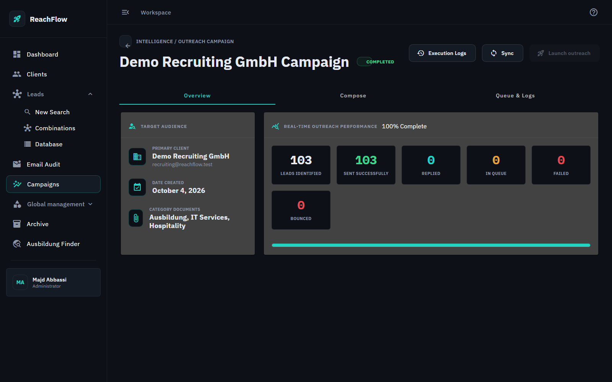
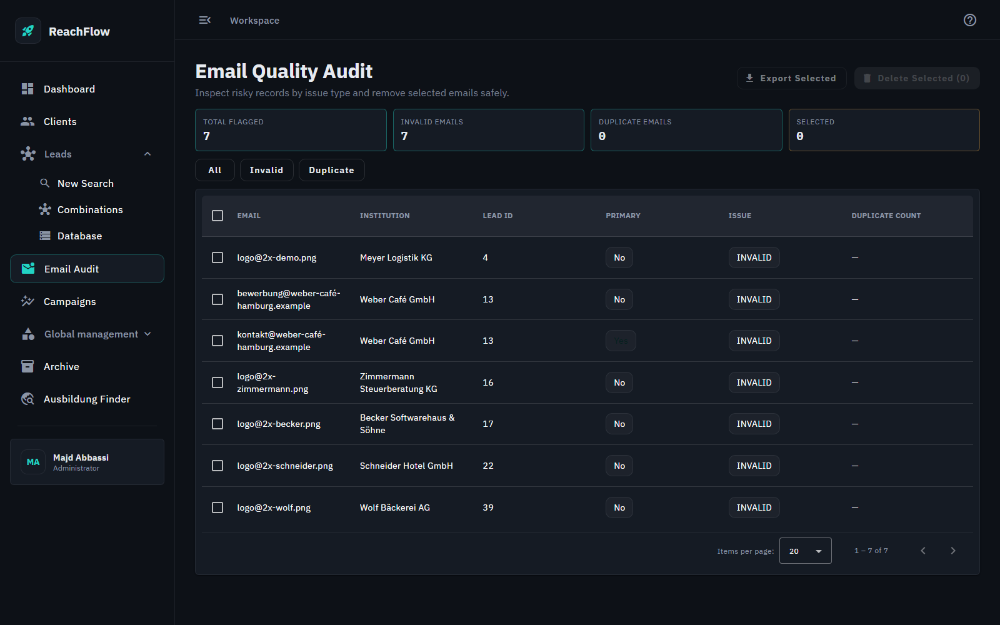
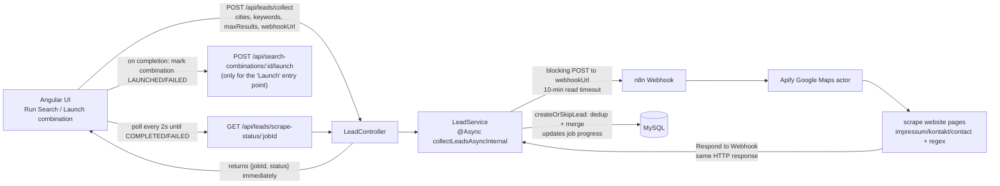
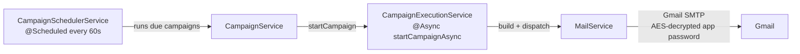

# ReachFlow 🚀

**ReachFlow** is a professional-grade outreach and lead generation platform designed to automate the discovery of prospects and streamline campaign management. Originally conceived as a tool to help find **Ausbildung (Apprenticeship)** opportunities in Germany, it has evolved into a robust full-stack solution integrating advanced automation workflows.

[](https://github.com/Majdabbassi/ReachFlow/actions/workflows/ci.yml)

> **A local tool, by design.** ReachFlow runs on your own machine and has no login. It stores Gmail app
> passwords and can send email, so don't put it on a network others can reach. Every port is bound to
> `127.0.0.1`, CORS only allows the app's own origins, and the stored passwords are encrypted (AES-256-GCM).
> If you ever need several users, authentication is the first thing to add.

---

## 📸 Screenshots

| Dashboard | Lead Database |
|---|---|
|  |  |

| Ausbildung Finder | Lead Search |
|---|---|
|  |  |

| Campaign (103 of 103 delivered) | Email Audit |
|---|---|
|  |  |

> Screenshots use the bundled demo data: generated businesses on reserved `.example` domains, so no real person appears.

---

## Try it in two minutes (no accounts needed)

The real scraper needs an Apify key and the real mailer needs a Gmail app password. **Demo mode** replaces both with local stand-ins, so you can see the whole product work:

```bash
git clone https://github.com/Majdabbassi/ReachFlow.git
cd ReachFlow
docker compose -f docker-compose.yml -f docker-compose.demo.yml up -d --build
```

| What | Where |
|---|---|
| ReachFlow | http://localhost:8088 |
| **Fake inbox (MailHog)**: every campaign email lands here | http://localhost:8025 |
| Mock scraper | answers the same webhook as the n8n workflow, with generated German businesses |

1. Open the app: a demo client, three categories with attachments and 15 leads are already there.
2. **Ausbildung Finder** → pick a couple of professions and cities → *Find training companies*. Watch the live progress.
3. **Campaigns** → open the demo campaign → *Launch outreach*. Emails appear one by one in MailHog (with the PDF attached), and the counters update as they go.
4. Hit **Stop** part-way, then launch again: it resumes with the people not yet emailed, nobody gets two emails.

Switch to the real thing by running the plain `docker compose up -d` and following the n8n guide below.

---

## 🌟 The "Ausbildung Finder" Story
ReachFlow was born out of a real-world need: helping a friend navigate the complex German apprenticeship market. By automating the search process—identifying local businesses via Google Maps, extracting contact information, and managing outreach—ReachFlow transformed a manual, time-consuming task into a streamlined, data-driven operation.

---

## 🛠️ Technical Architecture

ReachFlow follows a modern, decoupled architecture:

- **Frontend**: Angular 20 with Angular Material.
- **Backend**: Spring Boot 3.5 (Java 21) providing a RESTful API, with a separate archive datasource (`reachflow_archive`) for archived clients and their campaigns.
- **Automation Engine**: n8n integration for Google Maps scraping and site-level email extraction.
- **Security**: Transparent field-level encryption (AES) for sensitive data (e.g., Gmail App Passwords) using a JPA `AttributeConverter`.
- **Infrastructure**: Fully containerized using Docker and Docker Compose.

### 🔀 How a lead search reaches n8n

Every lead collection — whether it's a broad multi-city search or launching a single search combination — goes through **one backend-mediated job/poll pattern**. The browser never talks to n8n directly.



There is **no callback endpoint** — the `@Async` backend thread blocks on the n8n HTTP call itself and waits for the *same response* to contain the scraped results (matching n8n's `Respond to Webhook` node). All entry points converge on this one path:

- **"Run Search"** (multi-city/keyword batch) calls it with the full search set.
- **"Launch"** (a single search combination) calls the exact same endpoint with a one-city, one-keyword payload, polls the same way, and on completion additionally calls `POST /api/search-combinations/{id}/launch` to record `LAUNCHED`/`FAILED` status on that combination row.

**Why one path, not two:** an earlier version had "Launch" post straight from the browser to the n8n webhook, bypassing the backend, so results could be previewed and selectively saved before committing them. Once the scraping/dedup logic (`LeadService.createOrSkipLead` — see below) matured enough to be trusted unconditionally, that manual review step stopped adding value, so the direct-to-n8n call was removed in favor of routing everything through the same job-based endpoint. This also closes a minor security gap: the raw n8n webhook URL is no longer exposed to, or callable directly from, the browser.

**Implementation note:** both entry points live in `lead-list.component.ts`. The polling mechanism was generalized from a single `pollingSubscription` field to a `pollingSubscriptions: Map<string, any>` keyed by `jobId`, via `startPollingForJob(jobId, combinationId)` — passing `combinationId: null` for a plain "Run Search" job, or an actual id for a "Launch", which additionally calls `launchSearchCombination()` with `LAUNCHED`/`FAILED` once that job's poll resolves. This lets a "Run Search" and one or more "Launch" calls run concurrently without interfering with each other. The old direct-webhook code path (`collectFromWebhook()` in `lead.service.ts`, plus the results-preview UI card and its supporting fields/methods in the component and template) was deleted rather than left dormant.

The **Ausbildung Finder** (route `/ausbildung-finder`) is the guided version of that same pipeline, built for the original story: pick apprenticeship professions ("Fachinformatiker Anwendungsentwicklung", "Mechatroniker", ...) and cities, and it searches "Ausbildung &lt;profession&gt;" in each, files every company it finds under the **Ausbildung** category, and shows the same live progress. Because the leads carry that category, the matching client's campaign picks them up automatically.


### 🧹 Deduplication & data quality

`LeadService.createOrSkipLead` runs identically no matter which entry point triggered the collection:

- **Three-tier dedup** (`findExistingLead`): matches on website first, then institution name + city, then any already-known email. This lets the same business turn up across multiple search combinations without creating duplicate lead records.
- **Email merge, not overwrite** (`mergeEmailsIntoLead`): newly scraped emails are added to the existing lead rather than replacing its data, and an existing primary email is never silently demoted.
- **Post-hoc invalid-email detection**: a SQL-backed audit view (`GET /api/leads/emails/audit?mode=invalid`) flags emails that fail a regex check or match known scraper artifacts (`.png`/`.jpg` suffixes from image URLs, `@2x` retina-asset naming, double-dash junk, etc.) for manual review — invalid-looking emails are saved first and surfaced for cleanup rather than silently dropped.

### ✉️ Campaign & delivery flow (separate from lead collection)

Once leads exist in the database, campaigns are a fully separate flow:



`CampaignSchedulerService` polls every 60 seconds for campaigns due to run and hands them to `CampaignService`/`CampaignExecutionService`, which sends via `MailService` over Gmail SMTP using the client's AES-encrypted app password.

**Delivery guarantees (and why they took some care):**

- *Start returns immediately.* The send loop runs on an `@Async` thread, reached through the Spring proxy (a plain same-class call silently skips `@Async` and would block the request for the whole campaign).
- *Every email is its own transaction.* The status (`SENT`, `FAILED`, `BOUNCED`) is saved the moment the email goes out, so the UI counters move live and a crash never forgets who was already contacted.
- *Stop is honoured.* Each iteration re-reads the campaign in a fresh transaction, so a stop request is seen on the very next email. A stopped campaign goes back to `DRAFT`; starting it again sends only the pending/failed ones, never a duplicate.
- *A finished campaign becomes `COMPLETED`*, and goes back to `DRAFT` when new leads arrive.

These behaviours are covered by an integration test that runs a real campaign against an in-process SMTP server (see Tests & CI). One honest edge: if the process dies between an SMTP send and its commit, that single email can be sent again on resume.

**Replies and Gmail sync.** On demand, `GmailScannerService` reads a client's Gmail over IMAP: `scan-sent` marks sends that went out from Gmail directly, and `scan-replies` marks the leads that answered (`REPLIED`).

---

## 🧠 Design Decisions & Rationale

### ❓ Why n8n for Scraping (Instead of a Custom Java Scraper)
Writing a reliable Google Maps scraper + headless-browser site crawler from scratch in Java is weeks of work (rate limits, DOM drift, captchas, proxy rotation). n8n decouples that brittle automation from the Spring Boot business logic — Apify is pre-integrated as a battle-tested provider for Google Maps results, and workflow changes are drag-and-drop with no backend redeploy.

*Trade-off:* one more service to run, a workflow JSON to import by hand, and a paid Apify account for real searches.

### ❓ Why a Job ID + Polling Pattern (Instead of a Webhook Callback)
The scrape can legitimately take minutes (many search-string combinations × per-site email extraction). Rather than holding a client HTTP connection open or building a separate callback endpoint, `POST /api/leads/collect` returns a `jobId` immediately, and the actual scrape runs on an `@Async` thread that blocks on n8n's response internally. The frontend polls `GET /api/leads/scrape-status/{jobId}` every 2 seconds to update progress. This trades an extra polling loop for a much simpler integration surface — one webhook URL, one response shape, no public callback route, and one single entry point for every kind of lead collection (see above). A callback would also need a URL that n8n can reach, which a laptop doesn't have.

*Trade-off:* a backend thread is held for the whole scrape (up to the 10-minute timeout), and job progress lives in memory, so a backend restart loses the progress display (the leads already saved stay).

### ❓ Why Java / Spring Boot for the Backend
- **Transactional consistency**: Campaigns, leads, CampaignSends, and audit records must agree — `@Transactional` + JPA makes this safe.
- **`@Async` + `@Scheduled` are first-class**: non-blocking scraping and scheduled campaign dispatch are built-in primitives, used directly in `LeadService`, `CampaignExecutionService`, and `CampaignSchedulerService`.
- **JPA Attribute Converter pattern**: a clean, transparent way to add field-level AES encryption to `Client.appPassword` without touching service code.

### ❓ Why Angular (Not React)
The UI is a dashboard-first experience — search filters, campaign controls, paginated audit tables. Angular Material provides tables, paginators, modals, and steppers out of the box, and strict-typed reactive forms fit the campaign editor without a third-party form library.

### ❓ Why DTOs (Not Raw Entities)
Every endpoint uses a dedicated DTO (`LeadDTO`, `ClientDTO`, `CampaignDTO`, `SearchCombinationDTO`, etc.), avoiding circular-reference JSON issues and keeping the public API shape independent of entity changes.

### ❓ Why AES Encryption Even in Local-Only
Gmail App Passwords are stored via a JPA `AttributeConverter` (`AttributeEncryptor`) that encrypts before write and decrypts on read, using AES-256-GCM with a fresh random IV per value, and one `Cipher` per call because a `Cipher` instance is not thread-safe (campaign sends and web requests decrypt concurrently). The key comes from `ENCRYPTION_KEY`; if it is unset a public development key is used and a warning is logged. For a personal tool plain text would technically work; the encryption demonstrates the pattern a real deployment would use, with zero operational overhead.

*Trade-off:* lose `ENCRYPTION_KEY` and the stored app passwords have to be entered again.

### ❓ Why No Login
ReachFlow is a single-user tool that runs on its owner's machine. A login would protect nothing that binding every port to `127.0.0.1` doesn't already protect. *Trade-off:* it can't be hosted or shared as is — which is why the note at the top of this README says so.

---

## ✨ Key Features

### 🔍 Intelligent Discovery
- Multi-source scraping via Apify (Google Maps) and a custom email extractor hitting `/impressum`, `/kontakt`, `/contact`, and the homepage.
- One unified collection pipeline (background job + progress polling) for both broad multi-city searches and single search-combination launches.
- A guided **Ausbildung Finder** for apprenticeship opportunities in Germany: choose professions and cities, one click, live progress, leads are filed under the right category.

### 📊 Analytics & Auditing
- Email audit views for invalid/duplicate addresses.
- Search combination tracking (per city × keyword, with LAUNCHED/FAILED status).
- Client archive: archiving a client moves it, with its campaigns and sends, to a separate `reachflow_archive` schema, where it can be browsed and restored (`ArchiveService`, `/api/archive`).
- Gmail scan over IMAP: mark sends made from Gmail directly, and leads that replied.

### ✉️ Campaign Management
- Scheduled campaign execution (`CampaignSchedulerService`, every 60s) and selective/manual sends.
- Asynchronous email dispatch via Spring `@Async`.
- Gmail SMTP delivery with AES-encrypted app passwords.

### 🛡️ Security
- Gmail app passwords are encrypted at rest with **AES-256-GCM** (random IV per value, tamper-evident), set your own key with `ENCRYPTION_KEY`; rows written by older versions are still readable.
- The API never returns a stored app password.
- Every published port is bound to `127.0.0.1`; CORS only allows the app's own origins.
- DTO-based API boundary — entities never travel across the wire.

---

## 🌱 Base Reference Data & Resetting the Environment

Two kinds of data live in the database, and it's worth knowing the difference before you run `docker-compose down -v`:

- **Base reference data** — German places (states/cities/districts) and a small set of starter categories/keywords (e.g. "Ausbildung"). This is safe, reusable scaffolding, not user content.
- **Everything else** (leads, clients, campaigns, search combinations) — real work product, wiped on `down -v` by design.

Both kinds of reference data **self-seed automatically and idempotently**, so a fresh start needs no manual setup:

- **Places**: seeded lazily the first time the frontend loads the Leads page (`POST /api/search-combinations/seed-germany` → `SearchCombinationService.seedGermanyHierarchy()`), using a find-or-create pattern — safe to call repeatedly, never duplicates.
- **Categories & keywords**: seeded once on backend startup via `CategorySeeder` (a `CommandLineRunner`), following the same find-or-create pattern. It creates a small starter set (Ausbildung, IT Services, Hospitality, each with a few keywords) only if they don't already exist — it never touches leads, clients, or anything you've customized.

**Recommended reset flow:**
```bash
docker-compose down -v      # wipes MySQL + n8n data volumes
docker-compose up -d        # backend seeds categories on boot; frontend seeds places on first load
```
No manual data entry needed to get back to a working demo state.

## 🚀 Getting Started

### Prerequisites
- Docker & Docker Compose
- Node.js & npm (for local frontend development)
- Java 21 & Maven (for local backend development)
- **Apify API Key**, only for the real scraper (n8n workflow); [demo mode](#try-it-in-two-minutes-no-accounts-needed) needs none

### Quick Start
1. Clone the repository:
   ```bash
   git clone https://github.com/Majdabbassi/ReachFlow.git
   cd ReachFlow
   ```
2. Start the environment:
   ```bash
   docker-compose up -d
   ```
3. Access the applications:
   - **Frontend**: `http://localhost:8088`
   - **Backend API**: `http://localhost:8082` (proxies to container port 8080)
   - **n8n Workflow**: `http://localhost:5678`
   - **phpMyAdmin**: `http://localhost:5051`

Then continue with the **n8n Workflow Import** section below to wire up the scraper.

---

## 🤖 n8n Workflow — Import & Configuration Guide

The workflow lives in `n8n/emails-collector.workflow.json` (exported n8n JSON) and runs as five nodes:

1. **Webhook** — receives `POST { cities, keywords, maxResults }`.
2. **parse apify input** *(Code)* — normalizes `cities`/`keywords` (handles arrays, JSON strings, or objects with `name`/`value`/`label`), builds every `"{keyword} in {city}"` combination as `searchStringsArray`, plus `maxCrawledPlacesPerSearch`.
3. **Run an Actor and get dataset** *(Apify)* — runs the Google Maps Scraper actor (`compass/crawler-google-places`) with those search strings.
4. **scrape website pages** *(Code)* — for each place with a website, fetches `/impressum`, the homepage, `/kontakt`, `/contact`, regex-extracts emails, dedupes, and filters out obvious asset-file false positives (`.png`, `.jpg`, `.css`, `.js`, etc.).
5. **Respond to Webhook** — returns `{ results: [...] }` directly as the HTTP response. **There is no separate callback request** to the backend.

### Step 1 — Import the JSON Workflow
1. Open the n8n UI at `http://localhost:5678`.
2. Click the **☰ hamburger menu** → **Workflows** → **+ New Workflow**.
3. In the top-right, click **"…"** → **Import from File**.
4. Select `n8n/emails-collector.workflow.json`.
5. Save the imported workflow.

### Step 2 — Configure the Apify Credential
1. Click the **Apify** node in the workflow canvas.
2. Open the **Credentials** dropdown → **Create new credential**.
3. Paste your Apify API token (from `console.apify.com` → Settings → Integrations → Personal API Tokens).
4. Save the credential and select it for the node.

### Step 3 — Get the Webhook URL
1. Click the **Webhook** node (top-left).
2. Copy the **Test / Production webhook URL**.
3. Paste that URL into the frontend's webhook URL field — it's **passed per-request** (via `CollectRequestDTO.webhookUrl` or the launch-combination payload), not read from a backend environment variable. There is no `N8N_WEBHOOK_URL` property in `application.properties`.
4. Verify the method is `POST` and expects a JSON body: `{ "cities": ["Berlin"], "keywords": ["Ausbildung Fachinformatiker"], "maxResults": 20 }`.

### Step 4 — Test End-to-End
- Click the **Webhook** node → **Listen for test event** in n8n.
- In the frontend → Leads → **Run Search** (or **Launch** a search combination).
- Watch n8n execute each node. When it responds, the backend imports the leads automatically and the frontend's progress poll flips to COMPLETED.

### Backend Endpoints Involved
- `POST /api/leads/collect` — starts an async job, returns `{ jobId, status }` immediately ([LeadController.java](backend/src/main/java/com/majd/reachflow/controller/LeadController.java)). Used by both "Run Search" and "Launch a combination".
- `GET /api/leads/scrape-status/{jobId}` — polled by the frontend every 2s for progress/completion.
- `POST /api/search-combinations/{id}/launch` — records LAUNCHED/FAILED status once a combination's job completes.
- `POST /api/leads/bulk` — still available for manual CSV/bulk imports outside the scraping pipeline.

All async scraping logic lives in [LeadService.java](backend/src/main/java/com/majd/reachflow/service/LeadService.java), which wraps a `RestTemplate` POST to the n8n webhook with a 10-minute socket timeout to accommodate large map-scrape jobs.

---

## 🧪 Tests & CI

```bash
cd backend
./mvnw test        # unit tests, no services needed
DB_HOST=localhost DB_NAME=reachflow_it DB_ARCHIVE_NAME=reachflow_it_archive ./mvnw test   # also runs the MySQL integration test
```

- `AttributeEncryptorTest`: round trip, unique ciphertext, tamper detection, reading old rows, and a multi-threaded test (it fails against the previous shared-`Cipher` implementation).
- `LeadServiceTest`: de-duplication and email merging.
- `CampaignSendingIntegrationTest` (runs when `DB_HOST` is set): runs a real campaign through an in-process SMTP server (GreenMail) and checks that start returns immediately, statuses are saved as emails go out, Stop is honoured, a resume sends each recipient exactly once, and the campaign ends `COMPLETED`. Each assertion was verified to fail when the bug it guards is reintroduced.

GitHub Actions runs the backend tests against a MySQL service, builds the Angular app, and validates both compose files on every push.

---

## 🔎 What Was Found and Fixed

The project was audited by running it end to end. Among the fixes: three `@Async` calls made from the same class silently ran synchronously (a search blocked the request for minutes, a campaign start blocked, and a lazy-loading error turned every import into "0 imported"); scraped leads never received a category, so no campaign ever emailed them; a whole campaign ran in one transaction (no progress, Stop ignored, campaigns stuck `RUNNING`); a stopped campaign flipped back to `RUNNING`; the UI stopped polling after two minutes; and the password cipher was a shared, non-thread-safe AES/ECB instance with a hard-coded key. Demo mode, loopback-only ports, tight CORS, tests and CI were added at the same time.

## ⚠️ Known Limits

- Verified end to end in demo mode (a fresh clone delivered 39 of 39 emails to the fake inbox). Real Gmail delivery, the real n8n + Apify path and the IMAP scanner have not been run against live accounts in this version.
- Scrape job progress is kept in memory (lost on a backend restart).
- No authentication, by design (see the note at the top).

---

## 📈 Future Roadmap
- [ ] Visual Email Template Editor
- [ ] Email tracking pixel for Open Rate monitoring
- [ ] AI-driven personalized email generation
- [ ] LinkedIn integration for multi-channel outreach

---

*Developed by Majd - A showcase of full-stack engineering and automation.*
