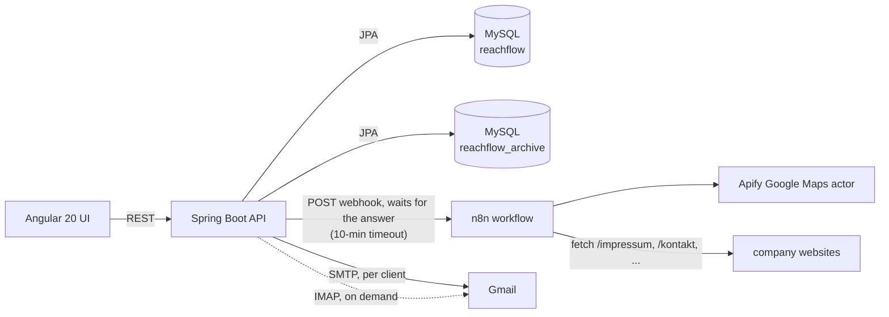
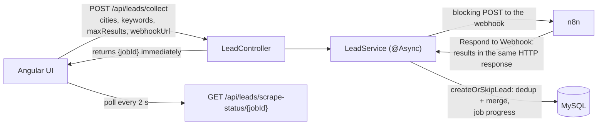

# ReachFlow

Lead generation and email outreach in one local tool: search for businesses by city and keyword (Google Maps through an n8n + Apify workflow), keep a de-duplicated lead database, and send personalised campaigns with category-specific attachments through each client's Gmail. It started as a way to help a friend find an **Ausbildung** (apprenticeship) in Germany, and the guided "Ausbildung Finder" is still its main flow.

**Spring Boot 3.5 · Java 21 · MySQL · Angular 20 + Material · n8n + Apify · Docker Compose**

[](https://github.com/Majdabbassi/ReachFlow/actions/workflows/ci.yml)

> **A local tool, by design.** ReachFlow runs on your own machine and has no login. It stores Gmail app
> passwords and can send email, so don't put it on a network others can reach. Every port is bound to
> `127.0.0.1`, CORS only allows the app's own origins, and the stored passwords are encrypted (AES-256-GCM).
> If you ever need several users, authentication is the first thing to add.

| Dashboard | Lead Database |
|---|---|
|  |  |

| Ausbildung Finder | Lead Search |
|---|---|
|  |  |

| Campaign (103 of 103 delivered) | Email Audit |
|---|---|
|  |  |

Screenshots use the bundled demo data: generated businesses on reserved `.example` domains, so no real person appears.

## Try it in two minutes (no accounts needed)

The real scraper needs an Apify key and the real mailer needs a Gmail app password. **Demo mode** replaces both with local stand-ins:

```bash
git clone https://github.com/Majdabbassi/ReachFlow.git
cd ReachFlow
docker compose -f docker-compose.yml -f docker-compose.demo.yml up -d --build
```

| What | Where |
|---|---|
| ReachFlow | http://localhost:8088 |
| **Fake inbox (MailHog)**: every campaign email lands here | http://localhost:8025 |
| Mock scraper | answers the same webhook as the n8n workflow, with generated German businesses |

1. Open the app: a demo client, three categories with attachments and 15 leads are already there.
2. **Ausbildung Finder** → pick a couple of professions and cities → *Find training companies*. Watch the live progress.
3. **Campaigns** → open the demo campaign → *Launch outreach*. Emails appear one by one in MailHog (with the PDF attached), and the counters update as they go.
4. Hit **Stop** part-way, then launch again: it resumes with the people not yet emailed, and nobody gets two emails.

## Architecture



In demo mode the n8n box is replaced by the mock scraper and Gmail by MailHog; nothing else changes.

### How a lead search works

Every lead collection — a broad multi-city search, a single search combination, or the Ausbildung Finder — goes through **one backend job**. The browser never talks to n8n.



The `@Async` thread posts to the n8n webhook and waits for the *same* HTTP response to carry the scraped results (n8n's `Respond to Webhook` node), so there is no callback endpoint. Progress lives in an in-memory tracker that the UI polls every 2 seconds. "Launch" on a single search combination uses the same endpoint and then records `LAUNCHED`/`FAILED` on that combination; several jobs can run at once, each polled by its own job id. The Ausbildung Finder searches "Ausbildung &lt;profession&gt;" in each chosen city and files every company under the **Ausbildung** category, so the matching client's campaign picks them up automatically.

**De-duplication** (`LeadService.createOrSkipLead`) is the same for every entry point: match on website first, then name + city, then any already-known email; newly found emails are **merged** into the existing lead, and an existing primary email is never demoted. Suspicious addresses (regex failures, scraper artifacts such as `.png` suffixes or `@2x`) are kept and listed in an audit view (`GET /api/leads/emails/audit?mode=invalid`) for manual cleanup rather than silently dropped.

### How a campaign is sent

`CampaignService.startCampaign` returns at once; the send loop runs on an `@Async` thread reached through the Spring proxy. `CampaignSchedulerService` also checks every 60 seconds for campaigns that are due. `MailService` then sends email by email:

- **each email is its own transaction:** a fresh read of the campaign (so a Stop from the UI is seen on the very next email), the SMTP send with the client's decrypted app password, then the status (`SENT`, `FAILED`, `BOUNCED`) committed immediately — the counters move live and a crash never forgets who was contacted;
- **Stop** puts the campaign back to `DRAFT`; starting it again sends only the pending and failed ones;
- a finished campaign becomes `COMPLETED`, and goes back to `DRAFT` when new leads arrive.

On demand, `GmailScannerService` reads a client's Gmail over IMAP to mark sends that went out from Gmail directly (`scan-sent`) and leads that replied (`scan-replies`).

Archiving a client moves it, with its campaigns and sends, to a separate `reachflow_archive` schema through a second datasource; it can be browsed there and restored (`ArchiveService`, `/api/archive`).

## Key decisions and trade-offs

1. **n8n for scraping instead of a Java scraper.**
   *Why:* a reliable Google Maps scraper plus a site crawler is weeks of work (rate limits, DOM drift, captchas); Apify already does it, and the n8n workflow can be changed by drag and drop without redeploying the backend. *Cost:* one more service, a workflow JSON to import by hand, and a paid Apify account for real searches.
2. **One backend job that waits for n8n, plus polling** — instead of a webhook callback.
   *Why:* a callback needs a URL that n8n can reach; on a laptop there is none. Waiting on n8n's own response keeps one webhook, one response shape and no public route. *Cost:* a backend thread is held for the whole scrape (up to the 10-minute timeout), and job progress is in memory, so a backend restart loses it (the leads already saved stay).
3. **Everything through the backend.**
   *Why:* an earlier version let "Launch" call n8n straight from the browser to preview results before saving. Once de-duplication was trustworthy that review step added nothing, and it exposed the webhook URL to the browser, so it was removed and every entry point now uses the job above.
4. **One transaction per email.**
   *Why:* the original sent a whole campaign in one transaction: no live progress, Stop never seen, and a crash lost the record of who had been emailed. Committing after each email makes progress real-time and Stop immediate. *Cost:* one commit per email (irrelevant next to SMTP latency), and if the process dies between an SMTP send and its commit, that single email can be sent again on resume.
5. **Encrypt the Gmail app passwords even locally.**
   *Why:* a stolen database file should not hand over mail accounts. A JPA `AttributeConverter` encrypts with AES-256-GCM, a random IV per value and one `Cipher` per call (a shared `Cipher` is not thread-safe, and campaigns decrypt concurrently with web requests). *Cost:* lose `ENCRYPTION_KEY` and the stored passwords must be entered again; without it a public development key is used and a warning is logged.
6. **No authentication, on purpose.**
   *Why:* it is a single-user tool that runs on the owner's machine; a login would protect nothing that binding to `127.0.0.1` does not. *Cost:* it cannot be hosted or shared as is — that is stated at the top of this README.

DTOs are used for every endpoint (no entity crosses the wire, no circular JSON), and the API never returns a stored app password.

## What was found and fixed

The project was audited by running it end to end. Among the fixes: three `@Async` calls made from the same class silently ran synchronously (a search blocked the request for minutes, a campaign start blocked, and a lazy-loading error turned every import into "0 imported"); scraped leads never received a category, so no campaign ever emailed them; a whole campaign ran in one transaction (no progress, Stop ignored, campaigns stuck `RUNNING`); a stopped campaign flipped back to `RUNNING`; the UI stopped polling after two minutes; and the password cipher was a shared, non-thread-safe AES/ECB instance with a hard-coded key. Demo mode, loopback-only ports, tight CORS, tests and CI were added at the same time.

## Getting started with the real scraper and Gmail

Prerequisites: Docker with Compose, an **Apify API token** (for real searches) and a **Gmail app password** per client (for real sending). Java 21 + Maven and Node.js are only needed to work on the code outside Docker.

```bash
docker compose up -d
```

| Service | URL |
|---|---|
| Frontend | http://localhost:8088 |
| Backend API | http://localhost:8082 (container port 8080) |
| n8n | http://localhost:5678 |
| phpMyAdmin | http://localhost:5051 |

Set `ENCRYPTION_KEY` before storing real app passwords. Then import the workflow:

### n8n workflow

The workflow is `n8n/emails-collector.workflow.json`, five nodes:

1. **Webhook** — receives `POST { cities, keywords, maxResults }`.
2. **parse apify input** (Code) — normalizes `cities` / `keywords` (arrays, JSON strings, or objects with `name` / `value` / `label`) and builds every `"{keyword} in {city}"` search string, plus `maxCrawledPlacesPerSearch`.
3. **Run an Actor and get dataset** (Apify) — runs the Google Maps scraper actor (`compass/crawler-google-places`).
4. **scrape website pages** (Code) — for each place with a website, fetches `/impressum`, the homepage, `/kontakt` and `/contact`, extracts emails with a regex, de-duplicates them and drops asset-file false positives (`.png`, `.jpg`, `.css`, `.js`, …).
5. **Respond to Webhook** — returns `{ results: [...] }` as the HTTP response.

To set it up:

1. Open n8n at http://localhost:5678 → **Workflows** → **New** → **…** → **Import from File** → `n8n/emails-collector.workflow.json` → save.
2. Click the **Apify** node → **Credentials** → **Create new credential**, paste your Apify token (console.apify.com → Settings → Integrations), save and select it.
3. Click the **Webhook** node and copy its production URL. Paste it into the webhook field in the app: the URL is sent with each request (`CollectRequestDTO.webhookUrl`), not read from a backend setting.
4. Test: in n8n, **Listen for test event** on the Webhook node; in the app, **Leads → Run Search**. When n8n answers, the backend imports the leads and the progress poll flips to `COMPLETED`.

Backend endpoints involved: `POST /api/leads/collect` (start a job), `GET /api/leads/scrape-status/{jobId}` (progress), `POST /api/search-combinations/{id}/launch` (combination status), and `POST /api/leads/bulk` for manual CSV/bulk imports.

### Reference data and resetting

German places (states, cities, districts) and starter categories with keywords (Ausbildung, IT Services, Hospitality) **seed themselves idempotently**: places on the first load of the Leads page (`POST /api/search-combinations/seed-germany`), categories on backend start-up (`CategorySeeder`), both find-or-create. Leads, clients, campaigns and search combinations are your data and are wiped by `docker compose down -v`; after `docker compose up -d` the reference data comes back by itself.

## Tests & CI

```bash
cd backend
./mvnw test        # unit tests, no services needed
DB_HOST=localhost DB_NAME=reachflow_it DB_ARCHIVE_NAME=reachflow_it_archive ./mvnw test   # also runs the MySQL integration test
```

10 tests:

- `AttributeEncryptorTest` (6): round trip, unique ciphertext, tamper detection, reading rows written by the old cipher, and a multi-threaded test that fails against the previous shared-`Cipher` implementation.
- `LeadServiceTest` (3): de-duplication and email merging.
- `CampaignSendingIntegrationTest` (1, runs when `DB_HOST` is set): a real campaign through an in-process SMTP server (GreenMail) — start returns immediately, statuses are saved as emails go out, Stop is honoured, a resume sends each recipient exactly once, and the campaign ends `COMPLETED`. Each assertion was checked to fail when its bug is reintroduced.

GitHub Actions runs the backend tests against a MySQL service, builds the Angular app and validates both compose files on every push.

## Known limits

- Verified end to end in demo mode (a fresh clone delivered 39 of 39 emails to the fake inbox). Real Gmail delivery, the real n8n + Apify path and the IMAP scanner have not been run against live accounts in this version.
- Scrape job progress is kept in memory (lost on a backend restart).
- No authentication, by design (see the note at the top).

## Roadmap

- Visual email template editor
- Open tracking
- AI-assisted personalised emails
- LinkedIn as a second channel
